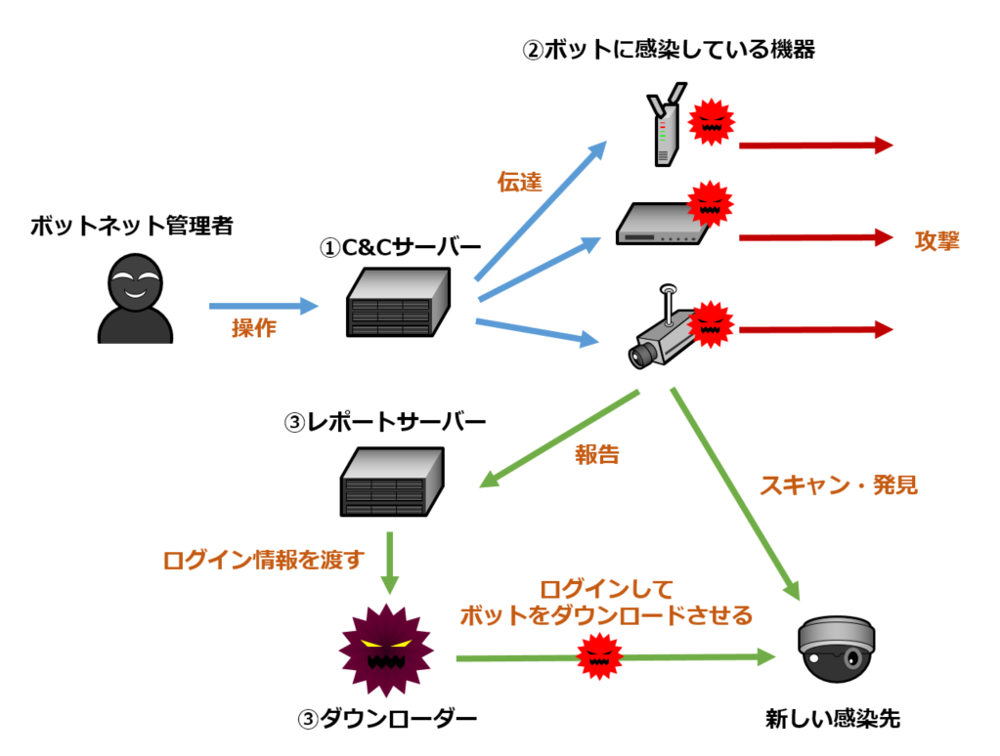

# Mirai
## a. General stats: how many machines, purpose, total network traffic
* 0.9 million routers
* DDoS
* 1 Tbps

## b. Method of C&C
* Star C&C topolpgy
* Telnet (23)
* API (101)

## c. Method of replication (pseudocode level)

1. Bots scan IoT
1. Feedback to Report Server(ScanListen)
1. Send target information to Load
1. Infect bot

## d. Types of attacks launched and the attacks’ victims. What would you do to defend against this botnet if your personal computer or personal subnet became victim?
* DDoS
* IoT: remote camera, home router
* Update firmware
* Change default passwords
* Try to disable SSH and Telnet services

## e. How would you preliminarily fix the OS or network protocol exploit that made the botnet possible (from either replication or C&C perspective)?
* It is hard

## f. How, if at all, was the botnet mitigated or stopped?
* Stopped, police arrested one suspected hacker
* New Virus variants

## Reference
* [Wikipedia Mirai (malware)](https://en.wikipedia.org/wiki/Mirai_(malware))
* [Wikipedia Mirai (恶意软件)](https://zh.wikipedia.org/wiki/Mirai_(%E6%81%B6%E6%84%8F%E8%BD%AF%E4%BB%B6))
* [Mirai源码分析报告](http://blog.nsfocus.net/mirai-source-analysis-report)
* \[原文\][「Mirai」ソースコード徹底解剖－その仕組みと対策を探る](http://www.atmarkit.co.jp/ait/articles/1611/08/news028.html)
* \[译文\][深度解析：恶意软件“Mirai”源代码的结构及其对策](http://netsecurity.51cto.com/art/201701/528172.htm?is_all=1)
* [蜜罐揭秘真实的Mirai僵尸网络](http://www.freebuf.com/articles/terminal/124717.html)
* [Mirai物联网僵尸攻击深度解析](http://www.freebuf.com/articles/terminal/117927.html)
* [Mirai is the hydra of IoT security: too many heads to cut off](http://www.pcworld.com/article/3180455/security/mirai-is-the-hydra-of-iot-security-too-many-heads-to-cut-off.html)
