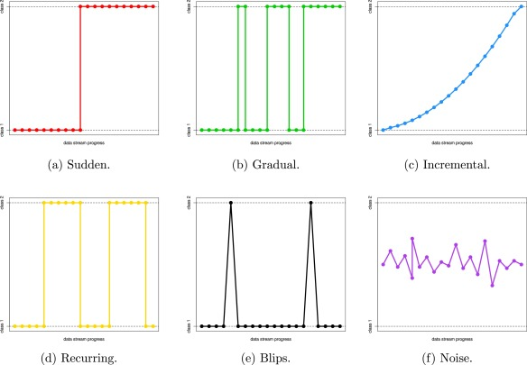
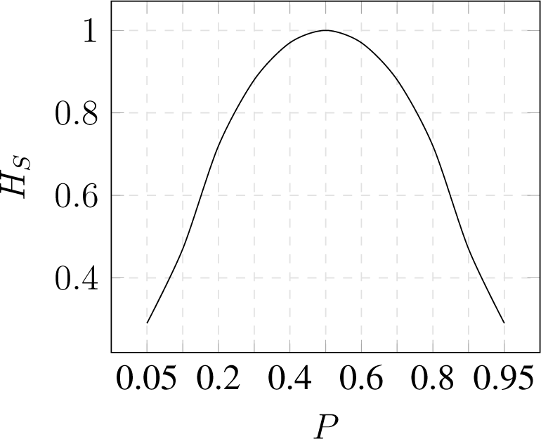
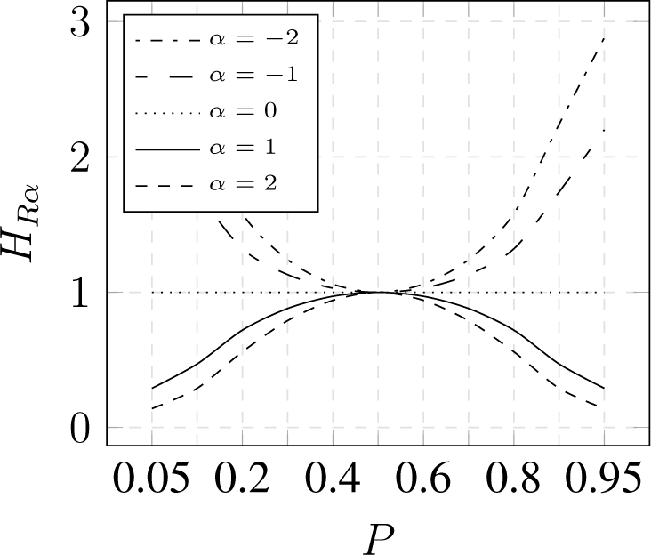

# Streaming Data and Entropy

<!-- TOC -->

- [Streaming Data](#streaming-data)
    - [Concept Drift](#concept-drift)
        - [Tackling Drifting](#tackling-drifting)
    - [Concept Evolution](#concept-evolution)
    - [Evaluation Criteria](#evaluation-criteria)
- [Data Processing](#data-processing)
    - [Instance Reduction](#instance-reduction)
    - [Dimensionality Reduction](#dimensionality-reduction)
    - [Feature Space Simplification](#feature-space-simplification)
- [Entropy](#entropy)
    - [Shannon Entropy](#shannon-entropy)
    - [Generalized Entropy](#generalized-entropy)
        - [Rényi Entropy](#rényi-entropy)
        - [Tsallis Entropy](#tsallis-entropy)
    - [Comparison by Binominal Distribution](#comparison-by-binominal-distribution)
- [References and Recommended Readings](#references-and-recommended-readings)

<!-- /TOC -->

## Streaming Data

* Stream data, a potentially unbounded(infinite size), ever-growing dataset
    * Volume, Velocity (Variety)
        * Too large for single memory
        * Too fast for single CPU
        * Too changeable for single machine learning system

| Stream Data and Processing                                      | Traditional Data and Processing                                      |
|-----------------------------------------------------------------|----------------------------------------------------------------------|
| Online/Real-time processing                                     | Offline processing                                                   |
| Linear and sub-linear computational techniques are widely used  | Techniques with high space and time complexity are used if necessary |
| Limitation on access times and process times for each instances | The restrictions are more loose                                      |
| Storage of all data is not feasible                             | Storage of data is feasible                                          |
| Store statistic, temporary, processed data                      | Storage of the raw data is possible                                  |
| Approximate results are acceptable                              | Accurate results are required                                        |
| Processing of samples of data is the usual task                 | Processing of every data item/record is the usual task               |
| Statistical characteristics change over time                    | Statistical characteristics are stable                               |

### Concept Drift

* Concept drift, The nature of data may evolve over time due to various conditions
* The number and relevance of instances and features may change by drifting

* Different influence on the learned classification boundaries
    * Real concept drift
    * Virtual concept drift

* Types of change
    * Sudden
    * Gradual
    * Incremental
    * Recurring
    * Blips
    * Noise
    * Mixed, more than one types

#### Tackling Drifting

* Concept drift detector
    * Explicit drift handling
    * Statistical criteria
        * SD
        * Predictive error
        * Instance distribution
        * Stability
    * Two stages
        * When drifting occurs, train a new classifier on recent instances
        * When drifting is severe, replace the old classifier with the new one
* Sliding windows
    * Implicit drift handling
    * Windows size is critical
* Online learner
    * Each object only be processed once
* Ensemble learner

### Concept Evolution

* New classes evolve in the data
* Solutions
    * Radius and adaptive threshold
    * Gini Coefficient
    * Multiple novel class detection

### Evaluation Criteria

* Predictive power
* Memory consumption
* Recovery time
    * The time about accommodating new instances and updating algorithm structure 
    * Process instances before new ones will arrive to avoid queuing
* Decision time
* Requirement for true class labels
    * Hard to label the entire data stream    
 
## Data Processing

### Instance Reduction

* Sampling
* Instance Selection (IS)
    * New concept may be classified as noise and removed by a misbehavior
* Instance Generation (IG)

### Dimensionality Reduction

* Feature Selection (FS)
    * Filter
        * Easily adaptable to the online environment
        * Hard to deal new features or classes
    * Wrapper
    * Hybrid
* Feature loss
    * Lossy Fixed (Lossy-F)
        * Fixed feature space
    * Lossy Local (Lossy-L)
        * Feature space varies with training batch
        * Feature space of training data may be different with test data
    * Lossless Homogenizing (Lossless)
        * Unify train/test feature space
        * Pad missing features

### Feature Space Simplification 

* Normalization
* Discretization
    * Bins
        * $$\#$$ bins
        * Size\boundaries of bins

## Entropy

### Shannon Entropy

$$Hs(X) = - \sum_{i=1}^n p(x_i) \log_a(p(x_i))$$

### Generalized Entropy

* **Control the tradeoff between contributions from the main mass of the distribution and the tail**

$$\langle X \rangle _{\phi} = \phi^{-1} (\sum_{i=1}^n p(x_i) \phi(x_i))$$

#### Rényi Entropy

$$\phi(x_i) = 2^{(1-\alpha)x_i}$$

$$H_{R\alpha}(X) = \frac{1}{1-\alpha}\log_a(\sum_{i=1}^n p(x_i)^{\alpha})$$

$$ \lim_{\alpha \to 1}H_{R\alpha}(X) = Hs(X)$$

#### Tsallis Entropy

$$\phi(x_i) = \frac{2^{(1-\alpha)x_i}-1}{1-\alpha}$$

$$H_{T\alpha}(X) = \frac{1}{1-\alpha}(\sum_{i=1}^n p(x_i)^{\alpha} - 1)$$

$$ \lim_{\alpha \to 1}H_{T\alpha}(X) = \log2Hs(X)$$

### Comparison by Binominal Distribution

* $$p$$, probability of success
* $$1-p$$, probability of failure

Shannon entropy

Rényi entropy of several $$\alpha$$-values

Tsallis entropy of several $$\alpha$$-values

## References and Recommended Readings

* [Data Stream Algorithms Intro, Sampling, Entropy](http://slideplayer.com/slide/8148340/)
* [Data Stream Mining](http://www.cse.ust.hk/~qyang/4332/PPT/stream.ppt)
* A survey on data preprocessing for data stream mining: Current status and future directions
* Classification and Novel Class Detection of Data Streams in a Dynamic Feature Space
* Data Stream Mining, _Data Mining and Knowledge Discovery Handbook_
* [An Entropy-Based Network Anomaly Detection Method](http://www.mdpi.com/1099-4300/17/4/2367/htm)
* [Rényi entropy, wikipedia](https://en.wikipedia.org/wiki/R%C3%A9nyi_entropy)
* [Shannon entropy in the context of machine learning and AI](https://medium.com/swlh/shannon-entropy-in-the-context-of-machine-learning-and-ai-24aee2709e32)
* [WELCOME TO THE ENTROPY ZOO](http://www.statslab.cam.ac.uk/biid2013/slides/EntropyZoo.pdf), [Beyond i.i.d. in information theory](http://www.statslab.cam.ac.uk/biid2013/)
* [Philippe Faist, The Entropy Zoo](https://www.its.caltech.edu/~phfaist/entropyzoo)
